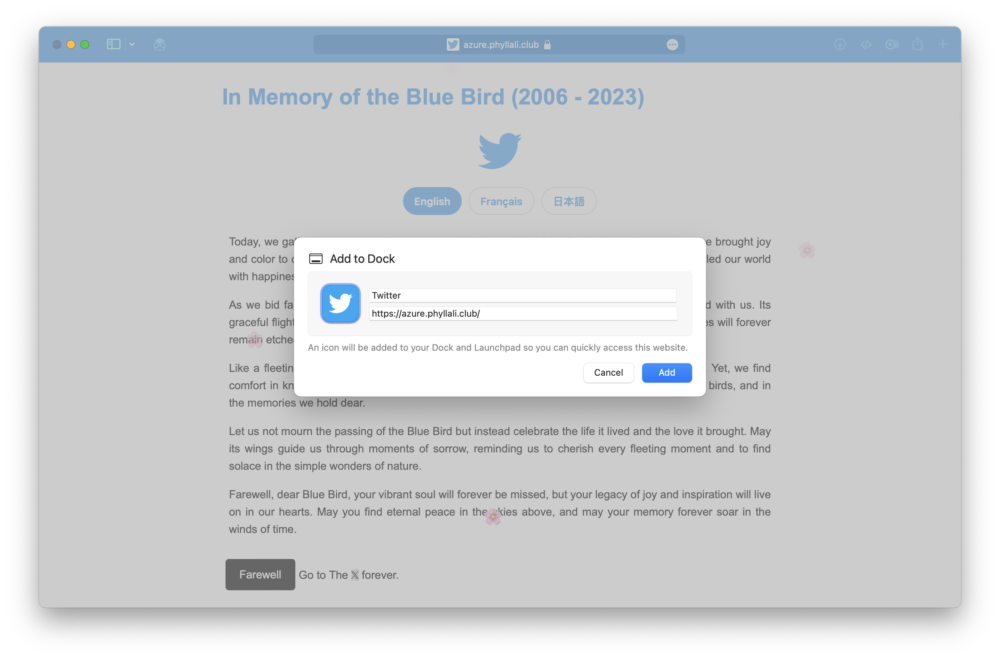

# Tomb of AzureBird

This PWA app will grace your home screen with a solemn Twitter icon, and as you bid farewell, clicking the mournful button, this emblem shall forever lead you to the realm of 𝕏 app (an installed client is needed).

---

In Memory of the Blue Bird

Today, we gather here to pay tribute to a special little soul, the Blue Bird, whose vibrant presence brought joy and color to our lives. With its azure plumage and melodious songs, it touched our hearts and filled our world with happiness.

As we bid farewell to this precious creature, we remember the moments of pure bliss it shared with us. Its graceful flights across the cerulean skies and the way it fearlessly soared through life's challenges will forever remain etched in our memories.

Like a fleeting dream, the Blue Bird has now taken its final flight to a realm beyond our reach. Yet, we find comfort in knowing that its spirit will forever dwell in the beauty of nature, in the songs of other birds, and in the memories we hold dear.

Let us not mourn the passing of the Blue Bird but instead celebrate the life it lived and the love it brought. May its wings guide us through moments of sorrow, reminding us to cherish every fleeting moment and to find solace in the simple wonders of nature.

Farewell, dear Blue Bird, your vibrant soul will forever be missed, but your legacy of joy and inspiration will live on in our hearts. May you find eternal peace in the skies above, and may your memory forever soar in the winds of time.
